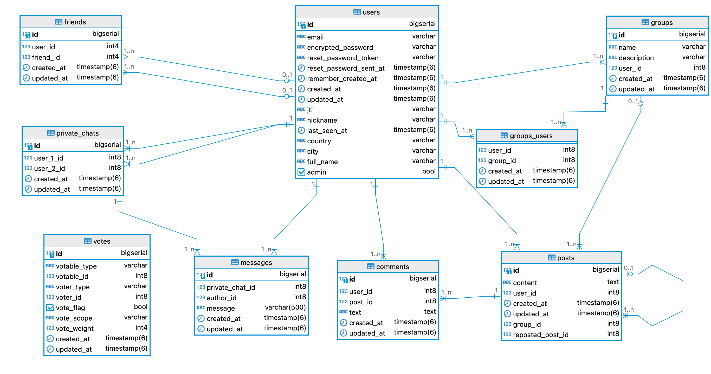
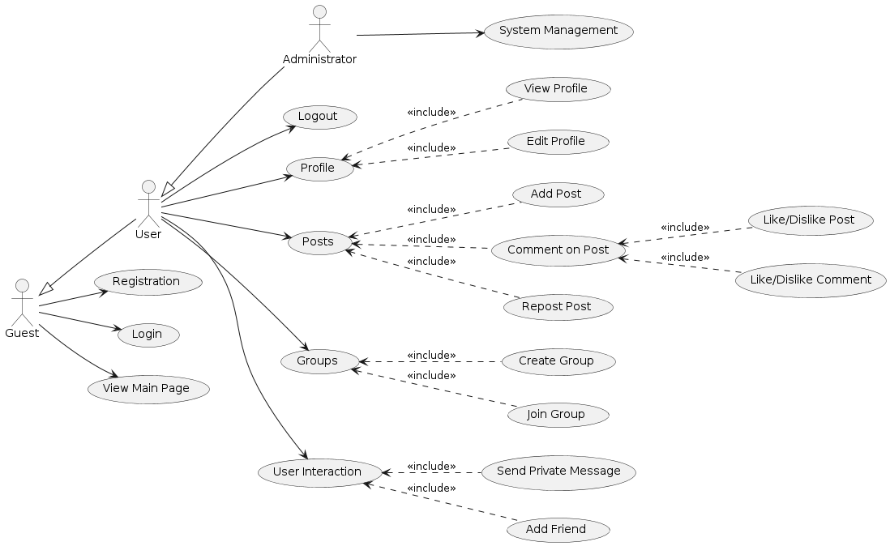

# Social Network

## Description

This is a social network built with Ruby on Rails, React, Docker, and PostgreSQL.     

### Team

<table>
    <tbody>
        <td align="center" valign="top" width="14.28%"><a href="https://github.com/RetiX1337"><br /><sub><b>Matvii Butenov</b></sub></a><br />💻🤔</td>
        <td align="center" valign="top" width="14.28%"><a href="https://github.com/biggujo"><br /><sub><b>Dmytro Ivashchenko</b></sub></a><br />💻🤔🚇</td>
        <td align="center" valign="top" width="14.28%"><a href="https://github.com/nottworry1"><br /><sub><b>Anastasiia Kupchenko</b></sub></a><br />💻📖</td>
    </tbody>
</table>
<a href="https://allcontributors.org/docs/en/emoji-key">Emoji meaning</a>

## Contents

- [Prerequisites](#prerequisites)
- [Set up](#set-up)
- [Scripts](#scripts)
- [API Documentation](#api-documentation)
- [Endpoints](#endpoints)

## Diagrams

### Database



### Use-Case



## Prerequisites

- Docker + Docker Compose
- a package manager (apt/brew/winget)

## Set up

### Development environment

> If you just need to run the app, skip this part

1. Setup hooks

```shell
./scripts/setup-hooks.sh
```

### Application

1. Run the Docker project

```shell
docker compose up
```

2. Create databases and run the migrations

```shell
docker exec -it coursework-rails rails db:create db:migrate
```

Access the services:
> - db: http://localhost:5400
> - backend: http://localhost:5401
> - frontend: http://localhost:5402

## Scripts

### Backend `rake` scripts

| Script                         | Description                                        |
|--------------------------------|----------------------------------------------------|
| `rake rubocop`                 | Run RuboCop (show offenses)                        |
| `rake rubocop:autocorrect`     | Autocorrect RuboCop offenses (only when it's safe) |
| `rake rubocop:autocorrect_all` | Autocorrect RuboCop offenses (safe and unsafe)     |

### Frontend `npm` scripts

| Script              | Description                              |
|---------------------|------------------------------------------|
| `npm run dev`       | Run the application                      |
| `npm run build`     | Get the build for a production           |
| `npm run lint`      | Run ESLint                               |
| `npm run style:fix` | Fix code style with Prettier             |
| `npm run preview`   | Run a live preview of a production build |

## API Documentation

API swagger is available at the [localhost:5401/api-docs](http://localhost:5401/api-docs).

## Endpoints

### Users

#### GET /users

Retrieves all users.

###### Responses

- `200`: Users found. Returns an array of User objects.

#### POST /users/profile

Updates a user.

###### Responses

- `200`: User updated.
- `422`: Invalid request

###### Request Body

- `email` (required, string)
- `nickname` (string)
- `city` (string)
- `country` (string)
- `full_name` (string)
- `profile_photo` (string)

#### GET /users/{id}

Retrieves a user.

###### Parameters

- `id` (path, required, integer)

###### Responses

- `200`: User found. Returns an array of User objects.

#### GET /users/{id}/posts

Retrieves a user's posts.

###### Parameters

- `id` (path, required, integer)

###### Responses

- `200`: Posts found. Returns an array of Post objects.

### Posts

#### GET /posts

Retrieves all posts.

###### Responses

- `200`: Posts found. Returns an array of Post objects.

#### POST /posts

Creates a post.

###### Request Body

- `content` (required, string)
- `group_id` (optional, integer)
- `reposted_post_id` (optional, integer)

###### Responses

- `201`: Post created. Returns an array of Post objects.
- `422`: Invalid request

#### GET /posts/{id}

Retrieves a post.

###### Parameters

- `id` (path, required, integer)

###### Responses

- `200`: Post found. Returns an array of Post objects.

#### PATCH /posts/{id}

Updates a post.

###### Parameters

- `id` (path, required, integer)

###### Request Body

- `content` (required, string)

###### Responses

- `200`: Post updated. Returns an array of Post objects.
- `422`: Invalid request

#### DELETE /posts/{id}

Deletes a post.

###### Parameters

- `id` (path, required, integer)

###### Responses

- `204`: Post deleted

### Comments

#### POST /posts/{post_id}/comments

Creates a comment.

###### Parameters

- `post_id` (path, required, integer)

###### Responses

- `201`: Comment created. Returns an array of Comment objects.
- `422`: Invalid request

###### Request Body

- `text` (required, string)

#### GET /posts/{post_id}/comments

Retrieves a post's comments.

###### Parameters

- `post_id` (path, required, integer)

###### Responses

- `200`: Comments found. Returns an array of Comment objects.

#### PATCH /posts/{post_id}/comments/{id}

Updates a comment.

###### Parameters

- `post_id` (path, required, integer)
- `id` (path, required, integer)

###### Responses

- `200`: Comment updated. Returns an array of Comment objects.
- `422`: Invalid request

###### Request Body

- `text` (required, string)

#### GET /posts/{post_id}/comments/{id}

Gets a comment.

###### Parameters

- `post_id` (path, required, integer)
- `id` (path, required, integer)

###### Responses

- `200`: Comments found. Returns an array of Comment objects.
- `404`: Comment not found

#### DELETE /posts/{post_id}/comments/{id}

Deletes a comment.

###### Parameters

- `post_id` (path, required, integer)
- `id` (path, required, integer)

###### Responses

- `204`: Comment deleted

### Friends
#### POST /users/{user_id}/friends

Add a friend.

###### Parameters

- `user_id` (path, required, string)

###### Responses

- `201`: Friend added successfully
- `422`: Can't add yourself as a friend
- `404`: User not found

###### Request Body

- `friend_id` (required, integer)

#### DELETE /users/{user_id}/friends/{id}

Remove a friend.

###### Parameters

- `user_id` (path, required, string)
- `id` (path, required, string)

###### Responses

- `200`: Friend removed successfully
- `404`: User not found

#### GET /users/{user_id}/friends/mutual_friends

List mutual friends.

###### Parameters

- `user_id` (path, required, string)

###### Responses

- `200`: Mutual friends found. Returns an array of User objects.
- `404`: User not found

#### GET /users/{user_id}/friends/followers

List followers.

###### Parameters

- `user_id` (path, required, string)

###### Responses

- `200`: Followers found. Returns an array of User objects.
- `404`: User not found

#### GET /users/{user_id}/friends/following

List following.

###### Parameters

- `user_id` (path, required, string)

###### Responses

- `200`: Following found. Returns an array of User objects.
- `404`: User not found

### Group

#### GET /groups

Retrieves all groups.

###### Responses

- `200`: Groups found. Returns an array of Group objects.

#### POST /groups

Creates a group.

###### Responses

- `200`: Group created. Returns an array of Group objects.
- `422`: Invalid request

###### Request Body

- `name` (required, string)
- `description` (required, string)

#### GET /groups/{id}

Retrieves a group.

###### Parameters

- `id` (path, required, string)

###### Responses

- `200`: Group found. Returns an array of Group objects.
- `404`: Group not found

#### PATCH /groups/{id}

Updates a group.

###### Parameters

- `id` (path, required, string)

###### Responses

- `200`: Group updated. Returns an array of Group objects.
- `422`: Invalid request

###### Request Body

- `name` (required, string)
- `description` (required, string)

#### DELETE /groups/{id}

Deletes a group.

###### Parameters

- `id` (path, required, string)

###### Responses

- `200`: Group deleted
- `404`: Group not found

#### POST /groups/{id}/members

Adds a member to the group.

###### Parameters

- `id` (path, required, string)
- `user_id` (query, string)

###### Responses

- `200`: Member added. Returns an array of User objects.
- `422`: User is already a member of this group
- `404`: Group or User not found

#### GET /groups/{id}/members

Lists members of the group.

###### Parameters

- `id` (path, required, string)

###### Responses

- `200`: Members found. Returns an array of User objects.
- `404`: Group not found

#### DELETE /groups/{id}/members/{user_id}

Removes a member from the group.

###### Parameters

- `id` (path, required, string)
- `user_id` (path, required, string)

###### Responses

- `200`: Member removed
- `422`: User is not a member of this group
- `404`: Group or User not found

#### GET /groups/{id}/posts

Lists posts of the group.

###### Parameters

- `id` (path, required, string)

###### Responses

- `200`: Posts found. Returns an array of Post objects.
- `404`: Group not found

### Likes

#### POST /like

Like an item.

###### Responses

- `200`: Successful. Returns an object with `likeable`, `likes_count`, and `dislikes_count`.

###### Request Body

- `likeable_type` (required, string, enum: Post, Comment): Type of the item to like
- `likeable_id` (required, integer): ID of the item to like

#### POST /dislike

Dislike an item.

###### Responses

- `200`: Successful. Returns an object with `likeable`, `likes_count`, and `dislikes_count`.

###### Request Body

- `likeable_type` (required, string, enum: Post, Comment): Type of the item to dislike
- `likeable_id` (required, integer): ID of the item to dislike

### Private Chats

#### GET /private_chats

Retrieves all private chats.

###### Responses

- `200`: Private chats found. Returns an array of PrivateChat objects.

#### POST /private_chats

Creates a private chat.

###### Request Body

- `user_1_id` (required, integer)
- `user_2_id` (required, integer)

###### Responses

- `201`: Private chat created. Returns an array of PrivateChat objects.
- `400`: Bad request

#### GET /private_chats/{id}

Retrieves a private chat.

###### Parameters

- `id` (path, required, integer)

###### Responses

- `200`: Private chat found. Returns an array of PrivateChat objects.

### Messages

#### GET /private_chats/{private_chat_id}/messages

Lists messages in a private chat.

###### Parameters

- `private_chat_id` (path, required, string)

###### Responses

- `200`: Successful. Returns an array of Message objects.

#### POST /private_chats/{private_chat_id}/messages

Creates a message in a private chat.

###### Parameters

- `private_chat_id` (path, required, string)

###### Responses

- `200`: Successful. Returns an array of Message objects.

### Password Recovery

#### POST /password/reset

Sends password recovery instructions.

###### Request Body

- `email` (required, string)

###### Responses

- `200`: Instructions sent
- `404`: Email not found

### Post Features

Endpoints `/posts`, `/users/:id/posts` and `/groups/:id/posts` support querying and pagination.
Example of post querying: `/users/2/posts?sort_activity=asc&content=c&start_date=2024-05-28&end_date=2024-05-29&sort_date=desc`
Example of post pagination: `/groups/2/posts?page=1&offset=2`
These endpoint also support csv export available at `/posts.csv`, `/users/:id/posts.csv` and `/groups/:id/posts.csv`

### Response Schemas

#### User

```json
{
  "id": "0",
  "email": "string",
  "city": "string",
  "country": "string",
  "full_name": "string",
  "nickname": "string",
  "last_seen_at": "01-01-1970",
  "created_at": "01-01-1970",
  "updated_at": "01-01-1970",
  "profile_photo": "url_to_picture"
}
```

#### Post

```json
{
  "id": "0",
  "content": "string",
  "created_at": "01-01-1970",
  "updated_at": "01-01-1970",
  "likes_count": "0",
  "dislikes_count": "0",
  "user": {nested user},
  "group": {nested group},
  "repost": {nested post},
  "liked": "false",
  "disliked": "false"
}
```

#### Comment

```json
{
  "id": "0",
  "name": "string",
  "created_at": "01-01-1970",
  "updated_at": "01-01-1970",
  "post_id": "0",
  "likes_count": "0",
  "dislikes_count": "1",
  "user": {nested user},
  "liked": "false",
  "disliked": "true"
}
```

#### Group

```json
{
  "id": "0",
  "name": "string",
  "description": "string",
  "user": {nested group},
  "created_at": "01-01-1970",
  "updated_at": "01-01-1970"
}
```

#### Private Chat

```json
{
  "id": "0",
  "user_1": {nested user},
  "user_2": {nested user},
  "created_at": "01-01-1970",
  "updated_at": "01-01-1970"
}
```

#### Message

```json
{
  "id": "0",
  "private_chat_id": "0",
  "author_id": "0",
  "message": "string",
  "created_at": "01-01-1970",
  "updated_at": "01-01-1970"
}
```

#### Like

```json
{
  "likeable_type": {nested likeable},
  "likes_count": 0,
  "dislikes_count": 0
}
```
